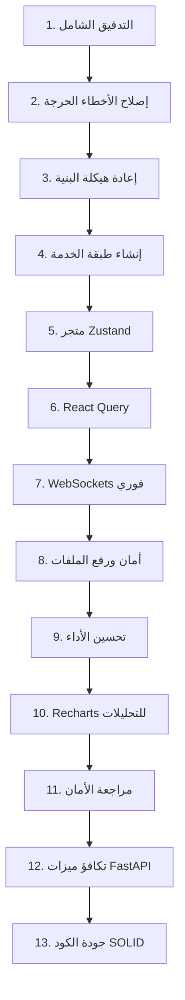

# خطة مراجعة وإعادة هيكلة وتحديث لوحة تحكم المحامين (Monolith Refactoring)

تهدف هذه الخطة إلى إعادة هيكلة وتحديث مكون `LawyerDashboard.jsx` وتحويله من مكون ضخم أحادي (Monolithic Component) يحتوي على جميع منطق العمليات، الاتصال بـ API، إدارة الحالة، الاستقصاء، ومحاكاة غرفة الاستشارة، إلى **بنية معيارية حديثة (Modular Component-Based Architecture)** وفقاً لأفضل ممارسات React في المشاريع الكبرى (Enterprise-grade).

---

## 1. تقرير مراجعة البنية والوضع الحالي (Architecture Review Report)

*   **المكون المستهدف:** [LawyerDashboard.jsx](file:///f:/yemen-lowyer/frontend/src/components/LawyerDashboard.jsx)
*   **الحجم الحالي:** أكثر من 1740 سطر برمجي في ملف واحد.
*   **المشاكل الأساسية المكتشفة:**
    *   **انتهاك مبدأ المسؤولية الفردية (SRP Violation):** المكون يقوم بإدارة واجهة المستخدم وتعديل البيانات والتواصل مع خادم FastAPI وتخزين الحالات الموقتة محلياً والتحكم بالجلسة الافتراضية للاتصال.
    *   **تكرار معالجة البيانات:** إدارة الحالات المتداخلة بواسطة `useState` مما يسبب زيادة عمليات إعادة الرندرة (Excessive Re-renders) غير الضرورية لجميع الأبناء عند كتابة رسالة دردشة أو تحديث مؤقت.
    *   **الاستقصاء المفرط (Heavy Polling):** طلب تفاصيل القضية كل 3 ثوانٍ وجلب التنبيهات كل 6 ثوانٍ يزيد من استهلاك موارد خادم FastAPI وقاعدة البيانات ويسبب بطء في المتصفح.
    *   **روابط ثابتة في الكود (Hardcoded URLs):** استخدام عنوان `http://localhost:8000` مباشرة.

---

## 2. مراجعة المستخدم المطلوبة (User Review Required)

> [!IMPORTANT]
> يرجى مراجعة واعتماد بنية النظام الجديدة والتكاملات المختارة:
> 1. **إدارة الحالة المتكاملة:** سنعتمد **Zustand** كمتجر مركزي خفيف وسريع لإدارة حالة المستخدم، القضايا، الاستشارات، الفواتير، التنبيهات، والملف الشخصي.
> 2. **إدارة حالة الخادم (Server State):** سنستخدم **TanStack React Query (v5)** لعمليات التخزين المؤقت (Caching)، تحديث البيانات في الخلفية، وإبطال الصلاحية تلقائياً.
> 3. **الاتصال الفوري:** سنقوم بتهيئة اتصالات **WebSocket** ثنائية الاتجاه مع FastAPI لإلغاء الاستقصاء (Polling) كلياً للمراسلات والتنبيهات.

---

## 3. أسئلة مفتوحة للمناقشة (Open Questions)

> [!NOTE]
> 1. **إعداد الخادم للـ WebSocket:** هل الواجهة الخلفية (FastAPI) تدعم حالياً مسارات الـ WebSocket المخصصة لغرف الدردشة والتنبيهات، أم سنقوم بإضافة الدعم لها في نفس الوقت؟ (المسار المقترح: `ws://127.0.0.1:8000/ws/cases/{case_id}`).
> 2. **حزم الـ Node.js الإضافية:** هل توافق على تشغيل أمر تثبيت الحزم المطلوبة (`npm install @tanstack/react-query zustand recharts`) كخطوة تحضيرية أولى؟

---

## 4. خطة الـ 13 مرحلة لإعادة الهيكلة والتحديث (13-Stage Roadmap)



### المرحلة الأولى: التدقيق الشامل (Comprehensive Auditing)
*   **المهمة:** فحص ملف `LawyerDashboard.jsx` وتحديد الاختناقات الأمنية، تسريبات الذاكرة الناتجة عن الـ `setInterval` المكررة، أخطاء الرندرة، الحالات غير المستخدمة، والتأكد من خلو ملفات الإنتاج من الأخطاء.

### المرحلة الثانية: إصلاح الأخطاء الحرجة (Critical Bug Fixing)
*   **المهمة:** التحقق من صيغ النشر (Spread Operator) مثل `...profileForm` و `...prev` و `...analytics` لضمان خلوها من أي تحذيرات أو أخطاء بناء جملة React أو Vite.

### المرحلة الثالثة: إعادة هيكلة البنية (Modularization)
*   **المهمة:** تقسيم الملف الأحادي إلى مكونات أصغر في مجلد [lawyer/](file:///f:/yemen-lowyer/frontend/src/components/lawyer):
    *   `DashboardLayout.jsx` & `Sidebar.jsx` & `Header.jsx`
    *   `overview/OverviewTab.jsx`
    *   `cases/CasesTab.jsx`, `CaseDetail.jsx`, `TimelinePanel.jsx`, `DocumentsPanel.jsx`, `HearingModal.jsx`, `MessagesPanel.jsx`
    *   `consultings/ConsultationsTab.jsx`, `VirtualSession.jsx`
    *   `billing/BillingTab.jsx`, `InvoiceTable.jsx`, `InvoiceModal.jsx`
    *   `analytics/AnalyticsTab.jsx` (دعم Recharts)
    *   `ai/AiAssistant.jsx`
    *   `settings/LawyerSettings.jsx`
    *   `notifications/NotificationDropdown.jsx`

### المرحلة الرابعة: إنشاء طبقة الخدمة (Service Layer)
*   **المهمة:** إنشاء مجلد [src/services/](file:///f:/yemen-lowyer/frontend/src/services) ويحتوي على خدمات مستقلة لإرسال الطلبات (Fetch wrapper) مثل `cases.service.js`, `consultations.service.js`, `ai.service.js` وغيرها، مع حقن تلقائي للتوكن (Authorization Bearer Header)، وإعادة محاولة الطلب عند الفشل (Retry) وتحديد المهلة (Timeout).

### المرحلة الخامسة: إدارة الحالة الحديثة (Zustand Store)
*   **المهمة:** إنشاء المتجر المركزي [src/store/lawyerStore.js](file:///f:/yemen-lowyer/frontend/src/store/lawyerStore.js) لحفظ الحالات المهنية مثل القضايا، العميل المختار، التحليلات، الإشعارات، والملف الشخصي وتعديلها عبر Actions واضحة.

### المرحلة السادسة: دمج React Query (Server State Integration)
*   **المهمة:** تكامل `@tanstack/react-query` للقيام بعمليات تخديم حالة الخادم، والتخزين المؤقت، والتحديث التلقائي في الخلفية (Background Revalidation) وإبطال كاش القضايا بعد الرفع أو الجدولة.

### المرحلة السابعة: إزالة الاستقصاء المتكرر (WebSocket Migration)
*   **المهمة:** استبدال دوال الاستقصاء المكرر (التي تطلب البيانات كل 3 أو 6 ثوانٍ) باتصالات **WebSockets** حقيقية ولحظية للدردشة والتنبيهات.

### المرحلة الثامنة: تحسينات إدارة الملفات (File Upload Upgrades)
*   **المهمة:** إعداد حدود لحجم الملفات، التحقق من نوع الملف (MIME types)، دعم إلغاء الرفع (AbortController)، واستخدام عنوان الـ API البيئي عبر `import.meta.env` وضبطه في ملف [src/config/api.js](file:///f:/yemen-lowyer/frontend/src/config/api.js).

### المرحلة التاسعة: تحسين الأداء (Performance Tuning)
*   **المهمة:** تطبيق `React.memo` على المكونات الثابتة، واستخدام `useMemo` لتصفية القوانين والتحليلات وحساب الأرباح، و `useCallback` لمعالجات الأحداث لمنع عمليات إعادة العرض (Re-renders) الزائدة.

### المرحلة العاشرة: تحسين التحليلات (Interactive Recharts)
*   **المهمة:** استبدال المخططات الشريطية والدائرية المصممة يدوياً بمخططات بيانية تفاعلية وغنية بالاعتماد على مكتبة **Recharts**.

### المرحلة الحادية عشرة: مراجعة الأمان (Security Audit)
*   **المهمة:** تأمين تخزين رموز JWT، الحماية من هجمات XSS عند عرض محتوى المساعد الذكي، والتحقق الصارم من مدخلات النماذج والقضايا.

### المرحلة الثانية عشرة: تكافؤ ميزات الواجهة الخلفية (Backend Parity)
*   **المهمة:** التحقق من عرض وتفعيل كافة ميزات FastAPI في الواجهة الأمامية مثل حالة التحقق للمحامي وعلاقات الفواتير المفصلة.

### المرحلة الثالثة عشرة: جودة الكود (SOLID & Clean Code)
*   **المهمة:** تصفية الكود وتطبيق مبادئ SOLID وتوحيد معايير التسمية وأنماط كتابة المكونات.

---

## 5. هيكل المشروع المحدث (Project Directory Structure)

بعد التنفيذ، ستصبح بنية مجلد `frontend/src` كالتالي:

```
src/
├── config/
│   └── api.js                  # إعدادات روابط الـ API والـ WebSocket حسب البيئة
├── store/
│   └── lawyerStore.js          # متجر Zustand للحالات العامة والمشتركة للمحامي
├── services/
│   ├── api.js                  # محرك جلب البيانات المركزي (HTTP Client Wrapper)
│   ├── cases.service.js
│   ├── consultations.service.js
│   ├── invoices.service.js
│   ├── notifications.service.js
│   ├── analytics.service.js
│   ├── laws.service.js
│   ├── documents.service.js
│   ├── profile.service.js
│   └── ai.service.js
├── components/
│   └── lawyer/
│       ├── DashboardLayout.jsx
│       ├── Sidebar.jsx
│       ├── Header.jsx
│       ├── overview/
│       │   └── OverviewTab.jsx
│       ├── cases/
│       │   ├── CasesTab.jsx
│       │   ├── CaseDetail.jsx
│       │   ├── TimelinePanel.jsx
│       │   ├── DocumentsPanel.jsx
│       │   ├── HearingModal.jsx
│       │   └── MessagesPanel.jsx
│       ├── consultings/
│       │   ├── ConsultationsTab.jsx
│       │   └── VirtualSession.jsx
│       ├── billing/
│       │   ├── BillingTab.jsx
│       │   ├── InvoiceTable.jsx
│       │   └── InvoiceModal.jsx
│       ├── analytics/
│       │   └── AnalyticsTab.jsx
│       ├── ai/
│       │   └── AiAssistant.jsx
│       ├── settings/
│       │   └── LawyerSettings.jsx
│       └── notifications/
│           └── NotificationDropdown.jsx
```

---

## 6. تسلسل هرمي جديد للمكونات (Component Hierarchy)

```
DashboardLayout (الملف الرئيسي المهيكل)
 ├── Sidebar (التبديل بين التبويبات)
 ├── Header (الترويسة وجرس الإشعارات)
 │    └── NotificationDropdown (منسدلة الإشعارات اللحظية)
 └── Main Content Area (منطقة عرض التبويب النشط)
      ├── OverviewTab (الإحصائيات السريعة والتقويم)
      ├── CasesTab (سجل القضايا وأرشيف المجلدات الشجري)
      │    └── CaseDetail (تفاصيل القضية النشطة)
      │         ├── TimelinePanel (المخطط الزمني المطور)
      │         ├── DocumentsPanel (منطقة السحب والإفلات وشريط التقدم)
      │         ├── MessagesPanel (قناة الدردشة اللحظية - WebSocket)
      │         └── HearingModal (نافذة جدولة الجلسات)
      ├── ConsultationsTab (جدول الاستشارات وحجز المواعيد)
      │    └── VirtualSession (غرفة الاتصال الافتراضي والمؤقت والمفكرة)
      ├── BillingTab (المالية وإصدار الفواتير وسندات القبض)
      │    ├── InvoiceTable (جدول استعراض الفواتير)
      │    └── InvoiceModal (نافذة إصدار الفواتير)
      ├── AnalyticsTab (التحليلات والمبيعات - Recharts)
      ├── AiAssistant (المساعد القانوني الذكي للدردشة)
      └── LawyerSettings (إعدادات مكتب المحاماة والأسعار)
```

---

## 7. مقترحات للتنفيذ البرمجي (Implementation Drafts)

### أ. كود مقترح لمتجر Zustand (`lawyerStore.js`)
```javascript
import { create } from 'zustand';

export const useLawyerStore = create((set) => ({
  cases: [],
  consultations: [],
  invoices: [],
  notifications: [],
  selectedCase: null,
  profile: null,
  isLoading: false,
  error: null,

  setCases: (cases) => set({ cases }),
  setConsultations: (consultations) => set({ consultations }),
  setInvoices: (invoices) => set({ invoices }),
  setSelectedCase: (selectedCase) => set({ selectedCase }),
  setProfile: (profile) => set({ profile }),
  setLoading: (isLoading) => set({ isLoading }),
  setError: (error) => set({ error }),
}));
```

### ب. كود مقترح لطبقة الخدمة المركزية (`api.js`)
```javascript
const getAuthToken = () => localStorage.getItem('arwa_token');

export const apiClient = async (endpoint, options = {}) => {
  const token = getAuthToken();
  const headers = {
    'Content-Type': 'application/json',
    ...(token && { 'Authorization': `Bearer ${token}` }),
    ...options.headers,
  };

  const config = {
    ...options,
    headers,
  };

  const response = await fetch(endpoint, config);
  if (!response.ok) {
    const errorData = await response.json().catch(() => ({}));
    throw new Error(errorData.detail || 'حدث خطأ أثناء جلب البيانات.');
  }
  return response.json();
};
```

---

## 8. خطة التحقق والجاهزية للإنتاج (Production-Readiness Checklist)

*   [ ] **توافق واجهة FastAPI:** التأكد من تطابق المخططات المستلمة مع API ومطابقة JWT.
*   [ ] **تكامل الأمان:** فحص كافة روابط المستندات ومنع تسريب بيانات المستخدمين.
*   [ ] **حزم العمل:** التحقق من تثبيت الحزم المطلوبة بنسخ تدعم React 19.
*   [ ] **بناء بيئة الإنتاج:** تشغيل `npm run build` للتحقق من سلامة البناء وخلوه من أي أخطاء لودر أو استيراد.
*   [ ] **ثبات الـ WebSockets:** إعداد نظام إعادة اتصال تلقائي (Reconnection Strategy) عند انقطاع خادم الـ WebSockets.
